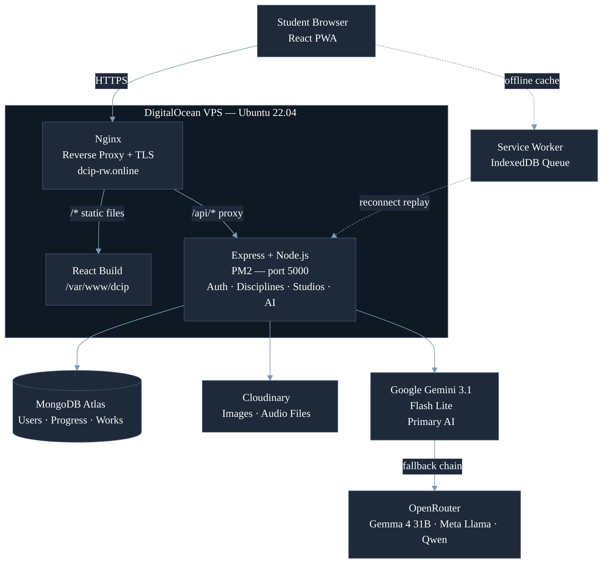

# DCIP: Digital Creative Infrastructure Platform

Digital Creative Infrastructure Platform is a self-directed digital learning platform for talented students in Rwandan rural secondary schools. Students build creative skills in Music, Visual Arts, and Graphic Design through structured levels, interactive tools like canvas, piano and guitar, and AI-assistance to hints and give feedback, all running in the computer labs their schools already have.

---

##  Links


| Live Site | [https://dcip-rw.online](https://dcip-rw.online) |
| Demo Video | [https://youtu.be/xHSAcLsjey0](https://youtu.be/xHSAcLsjey0) |
| Testing, discussion and Analysis | https://docs.google.com/document/d/1xmg1QJ8UTH0HcyQWnKVjKVfIAwqo_Vot9jMThG8EKEE/edit?usp=sharing |

Deployment document [DEPLOY.md](dcip-project/DEPLOY.md).
---

## Table of Contents

- [Live Deployment](#live-deployment)
- [Tech Stack](#tech-stack)
- [Features](#features)
- [Project Structure](#project-structure)
- [Local Setup](#local-setup)
- [Testing](#testing)
- [Deployment](#deployment)
- [Architecture](#architecture)

---

## Live Deployment

**URL:** [https://dcip-rw.online](https://dcip-rw.online)

The platform is deployed on a DigitalOcean VPS running Ubuntu 22.04, with Nginx as the reverse proxy, PM2 keeping the backend running, and a free HTTPS certificate from Certbot.

Full deployment instructions are in [DEPLOY.md](dcip-project/DEPLOY.md).

---

## Tech Stack

| Layer | Technology |
|---|---|
| Frontend | React 18, TypeScript, Vite, Tailwind CSS |
| PWA | vite-plugin-pwa, Service Worker, IndexedDB |
| Backend | Node.js 20, Express, TypeScript |
| Database | MongoDB Atlas (Mongoose) |
| File Storage | Cloudinary |
| AI: Primary | Google Gemini 3.1 Flash Lite |
| AI: Fallback | OpenRouter (Gemma 4 31B, NVIDIA Nemotron, Meta Llama, Qwen) |
| Auth | JWT (JSON Web Tokens) |
| Email | Nodemailer with Gmail App Password |
| Deployment | DigitalOcean VPS, PM2, Nginx, Certbot |

---

## Features

### Disciplines

DCIP offers five disciplines across three creative areas:

- **Music:** Guitar, Piano, Voice and Singing
- **Visual Arts:** Drawing and digital illustration
- **Graphic Design:** Layout, typography, and poster design

### Learning Stages

Each discipline has three levels. Each level has three stages:

1. **Learn** — theory content with an interactive tool (canvas, keyboard, or fretboard)
2. **Practise** — guided exercises with live feedback
3. **Demonstrate** — final submission to earn a level badge

Badges awarded: Beginner, Intermediate, Advanced. Completing all three levels unlocks the Production Studio.

### Production Studio

An open creative workspace where students work freely and save their work to a personal portfolio. Files are stored on Cloudinary. Students can organise their work into folders.

### AI Integration

- **Ask AI:** a chat panel on every course page. Students can ask questions, highlight text to ask about it, or upload an image for analysis.
- **AI Artwork Critique:** for Visual Arts and Graphic Design submissions. The AI grades the work using computer vision, then combines that score with an engagement score to produce a final grade.
- **AI Coach's Note:** for Music disciplines. After a result, the AI generates personalised feedback — encouragement if the student passed, or specific practice advice if they did not.
- **Fallback chain:** if Gemini is unavailable, the system tries OpenRouter alternatives automatically.

### Engagement Scoring

DCIP tracks how actively a student interacts during a session — time on canvas, tool use, interactions. This produces an engagement score (0–100) that is blended with the AI quality score for the final grade. This prevents a student from passing without any real interaction.

### Offline Support (PWA)

DCIP works offline. The Service Worker:
- Caches the app shell and static assets using a Cache-First strategy
- Uses Network-First for API calls, falling back to the cache when offline
- Queues any failed writes (saves, progress updates) in IndexedDB and replays them automatically when the connection returns

An offline banner appears when the connection drops. A sync notification appears on reconnect.

### Student Dashboard

The Student Dashboard is the first page a student sees after logging in. It shows:

- **Student identity** — the student's name and school are displayed at the top (e.g. Uwimana Chantal - GS Kigeme A, Nyamagabe)
- **Quick stats** — hours of practice, number of disciplines started, and total levels completed shown as summary cards
- **DCIP Studio shortcut** — a prominent card with an Enter Studio button for quick access to the creative studios
- **Your Disciplines** — cards for each discipline the student has enrolled in, showing the current badge level (Beginner, Intermediate, Advanced), a stage progress bar (e.g. 14/14 stages), milestone dots for Courses, Level 1, Level 2, Level 3, and Production, and a Continue button to resume where they left off
- **Skill Summary** — a compact progress overview at the bottom showing each discipline with a visual progress bar and the current badge level, with a View full report link to the full Skill Summary page

### Portfolio

The Portfolio is a dedicated section separate from the Studio. It automatically collects two types of student work in one place:

- **Demonstrate submissions** — the final work a student submitted at the end of each level across all disciplines
- **Production works** — creative pieces saved from the open Production Studio after completing all three levels

Students can view their full creative history here. Administrators can also view any student's portfolio to assess their output and progress across the platform.

### Skill Summary

The Skill Summary page gives students a clear overview of everything they have achieved on the platform. It shows:

- Which disciplines they have started and how far they have progressed
- Which level badges they have earned (Beginner, Intermediate, Advanced)
- An overall picture of their creative development across all five disciplines

This page helps students see their growth and helps administrators identify which students are advancing and which may need support.

### Admin Dashboard

Administrators can:
- View and manage all registered students
- Activate or deactivate student accounts
- Manage schools and disciplines
- View studio submissions and engagement analytics
- Download school performance reports
- Read student feedback submissions

---

## Project Structure

```
Capstone/
├── README.md
└── dcip-project/
    ├── nginx.conf                        # Nginx reverse proxy config
    ├── deploy.sh                         # One-command deployment script
    ├── DEPLOY.md                         # Full server setup guide
    │
    ├── Backend/
    │   ├── package.json
    │   ├── tsconfig.json
    │   ├── vitest.config.ts
    │   ├── ecosystem.config.js           # PM2 process config
    │   ├── .env.example
    │   └── src/
    │       ├── index.ts                  # Express app entry point
    │       ├── seed.ts                   # Seeds schools, modules, admin account
    │       │
    │       ├── config/
    │       │   ├── db.ts                 # MongoDB connection
    │       │   ├── cloudinary.ts         # Cloudinary setup
    │       │   └── openrouter.ts         # OpenRouter AI fallback setup
    │       │
    │       ├── controllers/
    │       │   ├── authController.ts     # Register, login, password reset
    │       │   ├── authController.test.ts
    │       │   ├── aiController.ts       # Gemini AI requests
    │       │   ├── portfolioController.ts
    │       │   ├── sessionController.ts
    │       │   └── studioController.ts
    │       │
    │       ├── middleware/
    │       │   ├── authMiddleware.ts     # JWT protect middleware
    │       │   ├── authMiddleware.test.ts
    │       │   └── requireRole.ts        # Role-based access control
    │       │
    │       ├── models/                   # Mongoose schemas
    │       │   ├── User.ts
    │       │   ├── School.ts
    │       │   ├── Module.ts
    │       │   ├── EngagementScore.ts
    │       │   ├── PracticeSession.ts
    │       │   ├── PortfolioItem.ts
    │       │   ├── StudioWork.ts
    │       │   ├── StudioFolder.ts
    │       │   ├── Draft.ts
    │       │   ├── Feedback.ts
    │       │   ├── StudentProgress.ts
    │       │   ├── JourneyProgress.ts
    │       │   ├── GDLevelPoster.ts
    │       │   ├── CurriculumLevel.ts
    │       │   ├── ProductionResult.ts
    │       │   ├── PianoDemonstrationProgress.ts
    │       │   ├── GuitarDemonstrationProgress.ts
    │       │   ├── VisualArtsDemonstrationProgress.ts
    │       │   ├── GDDemonstrationProgress.ts
    │       │   ├── VoiceDemonstrationProgress.ts
    │       │   ├── VAProductionResult.ts
    │       │   └── GDProductionResult.ts
    │       │
    │       ├── routes/                   # API route handlers
    │       │   ├── auth.ts
    │       │   ├── admin.ts
    │       │   ├── aiRoutes.ts
    │       │   ├── engagement.ts
    │       │   ├── engagement.test.ts
    │       │   ├── feedback.ts
    │       │   ├── sessions.ts
    │       │   ├── portfolio.ts
    │       │   ├── production.ts
    │       │   ├── studioRoutes.ts
    │       │   ├── drafts.ts
    │       │   ├── journey.ts
    │       │   ├── progressSummary.ts
    │       │   ├── piano.ts
    │       │   ├── guitar.ts
    │       │   ├── voice.ts
    │       │   ├── visualArts.ts
    │       │   └── graphicDesign.ts
    │       │
    │       └── seed/
    │           └── seedCurriculum.ts     # Seeds curriculum content
    │
    └── Frontend/
        ├── package.json
        ├── tsconfig.json
        ├── vite.config.ts
        ├── vitest.config.ts
        ├── tailwind.config.js
        ├── postcss.config.js
        ├── index.html
        ├── .env.production
        │
        ├── public/                       # Static assets served as-is
        │   ├── manifest.json             # PWA manifest
        │   ├── _headers
        │   └── images/                   # Discipline and UI images
        │
        ├── Resources/                    # Source images (discipline covers)
        │
        └── src/
            ├── App.tsx                   # Route definitions
            ├── main.tsx                  # React entry point
            ├── sw.ts                     # Service Worker (offline + sync)
            │
            ├── components/               # Reusable UI components
            │   ├── MainLayout.tsx
            │   ├── AdminLayout.tsx
            │   ├── TopNav.tsx
            │   ├── Footer.tsx
            │   ├── OfflineBanner.tsx
            │   ├── SyncToast.tsx
            │   ├── ai/                   # AI chat and critique modal
            │   ├── canvas/               # Visual Arts and GD toolbars
            │   ├── graphic-design/       # GD level screen, poster canvas
            │   ├── guitar/               # Fretboard, guitar level screen
            │   ├── piano/                # Keyboard, piano level screens
            │   ├── studio/               # Guitar, Piano, Voice, Visual Arts studios
            │   ├── visual-arts/          # VA level screen
            │   └── modules/              # Module wrappers
            │
            ├── pages/                    # One file per screen
            │   ├── HomePage.tsx
            │   ├── LoginPage.tsx
            │   ├── RegisterPage.tsx
            │   ├── DashboardPage.tsx
            │   ├── StudioPage.tsx
            │   ├── PortfolioPage.tsx
            │   ├── admin/                # Admin dashboard pages
            │   ├── guitar/               # Guitar levels, practise, demonstrate, production
            │   ├── piano/                # Piano levels, practise, demonstrate, production
            │   ├── voice/                # Voice levels, practise, demonstrate, production
            │   ├── visual-arts/          # VA levels, practise, demonstrate, production
            │   ├── graphic-design/       # GD levels, practise, demonstrate, production
            │   └── student/              # Student settings
            │
            ├── hooks/                    # Custom React hooks
            │   ├── useAuth.tsx
            │   ├── useOnlineStatus.ts
            │   ├── useSync.ts
            │   ├── useInactivityLogout.ts
            │   ├── useCanvasEngagement.ts
            │   └── ...progress and demo hooks per discipline
            │
            ├── services/
            │   ├── api.ts                # All API call functions
            │   └── db.ts                 # IndexedDB access
            │
            └── utils/
                ├── offlineDB.ts          # Offline queue helpers
                ├── syncQueue.ts          # Replay queued requests on reconnect
                ├── guitarVerification.ts
                ├── guitarVerification.test.ts
                ├── pianoTheory.ts
                ├── pianoTheory.test.ts
                ├── pianoVerification.ts
                ├── voiceVerification.ts
                └── voicePitch.ts
```

---

## Local Setup

### Prerequisites

- Node.js 20+ and npm 9+
- A MongoDB Atlas account: [mongodb.com/atlas](https://www.mongodb.com/atlas)
- A Cloudinary account: [cloudinary.com](https://cloudinary.com)
- A Google AI Studio key (Gemini): [aistudio.google.com](https://aistudio.google.com)
- An OpenRouter key (fallback AI): [openrouter.ai](https://openrouter.ai)

### 1. Clone the repository

```bash
git clone https://github.com/Uchantal/Capstone.git
cd Capstone/dcip-project
```

### 2. Install dependencies

```bash
cd Backend && npm install
cd ../Frontend && npm install
```

### 3. Configure environment variables

Create `dcip-project/Backend/.env`:

```env
PORT=5000
NODE_ENV=development

MONGODB_URI=mongodb+srv://<user>:<password>@cluster.mongodb.net/dcip
JWT_SECRET=your_jwt_secret_here

CLIENT_URL=http://localhost:5173
FRONTEND_URL=http://localhost:5173

EMAIL_USER=your_gmail_address@gmail.com
EMAIL_PASS=your_gmail_app_password

CLOUDINARY_CLOUD_NAME=your_cloud_name
CLOUDINARY_API_KEY=your_api_key
CLOUDINARY_API_SECRET=your_api_secret

GEMINI_API_KEY=your_gemini_api_key

OPENROUTER_API_KEY=your_openrouter_api_key
OPENROUTER_MODEL=google/gemma-4-31b-it:free
```

The `.env` file is in `.gitignore` and is never committed. The frontend needs no `.env` for local development — it points to `http://localhost:5000` by default.

### 4. Seed initial data (first run only)

```bash
cd Backend
npm run seed
npm run seed:curriculum
```

This creates the five schools, three modules, and the admin account.
Admin login: `username: admin` / `password: Admin2025`

### 5. Run the project

Open two terminals from `dcip-project/`:

```bash
# Terminal 1
cd Backend && npm run dev

# Terminal 2
cd Frontend && npm run dev
```

Open [http://localhost:5173](http://localhost:5173) in your browser.

---

## Testing

### Unit Testing

Unit tests are written with **Vitest** and cover the core logic of the platform.

Run backend tests:
```bash
cd dcip-project/Backend
npx vitest run
```

Run frontend tests:
```bash
cd dcip-project/Frontend
npx vitest run
```

**What is tested:**

| File | What it covers |
|---|---|
| `authController.test.ts` | Password strength rules, registration field validation |
| `authMiddleware.test.ts` | JWT protect middleware — valid token, missing header, expired token, wrong secret |
| `engagement.test.ts` | Engagement score computation, stage name validation |
| `guitarVerification.test.ts` | Guitar performance verification — note count, unique notes, chord presence, duration |
| `pianoTheory.test.ts` | Piano theory utility functions |

### Offline Testing

The PWA offline behaviour was tested by:
- Disabling the network in Chrome DevTools while using the platform
- Verifying the offline banner appeared and cached pages remained usable
- Reconnecting and confirming that queued writes (saved via IndexedDB) were replayed correctly

---

## Deployment

The live site runs on a DigitalOcean Droplet. After pushing changes to GitHub, SSH into the server and run:

```bash
cd /var/www/Capstone/dcip-project
bash deploy.sh
```

This pulls the latest code, rebuilds the backend and frontend, restarts PM2, and copies the new frontend build to the web root.

**Verify:**
```bash
pm2 status
curl http://localhost:5000/api/health
```

Full step-by-step server setup is in [DEPLOY.md](dcip-project/DEPLOY.md).

---

## Architecture



**How a request flows:**

1. The student opens `https://dcip-rw.online`.
2. Nginx serves the React build for all page routes.
3. API calls (`/api/*`) are proxied by Nginx to Express on port 5000.
4. Express reads and writes user data and progress to MongoDB Atlas.
5. Studio file uploads go to Cloudinary; the returned URL is stored in MongoDB.
6. AI requests go to Gemini first. If unavailable, OpenRouter tries the fallback models in order.
7. When offline, the Service Worker serves cached content and queues writes in IndexedDB for replay on reconnect.

---


